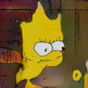
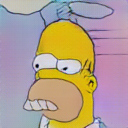
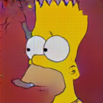

## Generating simpson faces using Deep Convolutional Generative Adversarial Networks.

GANs are a framework for teaching a DL model to capture the training data’s distribution so we can generate new data from that same distribution. I trained deep convolutional generative adversarial networks on a dataset of simpson faces to generate new faces based on the training samples. 
### Epoch 1 to 350 in one look:

  

### Dataset:
https://www.kaggle.com/kostastokis/simpsons-faces
9877 Simpsons faces, extracted from seasons 25-28, all in 200x200 resolution and each centered on a single face.

### Model:
The model includes a disciminator model which is made of convolution stages (Conv2d, BatchNorm, LeakyRelu) and a generator model with transpose convolution stages (TransposeConv2d, BatchNorm, LeakyRelu). The disciminator has 5 of such stages each with different number of convlayers and a fully connected layer at the end, and the generator is made up of 4 such transpose convolution stages and a convolution stage at the end. The negative slope of LeakyRelu is 0.2.

### How to make the DCGAN work:

There were a lot of tricky details for getting the DCGAN generate some sharp looking pictures. Some of the hacks I used:

* Using 0 as the label for the true class and 1 for fake labels for optimizer. Helps the optimizer to make better updates at the first couple of epochs.
* Smoothing the labels. Instead of 1 i used random numbers in range of [0.7,1.2] and instead of 0 range of [0,0.3]. Prevents the optimizer from reaching loss 0.
* Using noisy labels. I flipped the labels of 5% of the data. 
* Not using any pooling layer. Down sampling is done using stride of 2 in each convolutional layer.
* Using large number of large-sized filters of 5x5. 
* Using the 0.0002 leanring rate for both generator and discriminator.
* Using small batch size of 32. Helps the generator and discriminator to learn at the same pace.

Find out more about the hacks here:
* https://machinelearningmastery.com/how-to-code-generative-adversarial-network-hacks/
* https://medium.com/@utk.is.here/keep-calm-and-train-a-gan-pitfalls-and-tips-on-training-generative-adversarial-networks-edd529764aa9
* https://github.com/soumith/ganhacks

### My favorite generated pictures:

* The one on the left looks like the chicken version of the simposons :)
* 2 Mouths one on the neck :)
* Pre-historic look !
* Father+Son (Punk homer)

